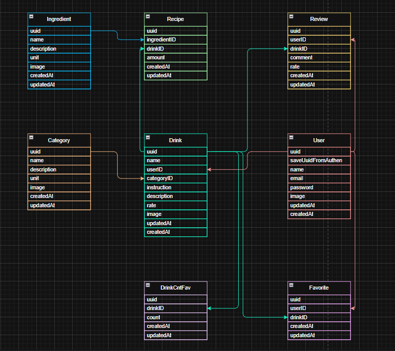
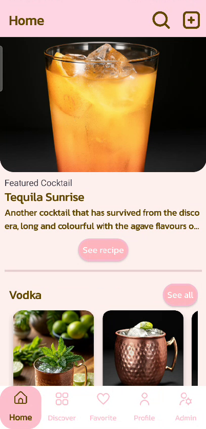
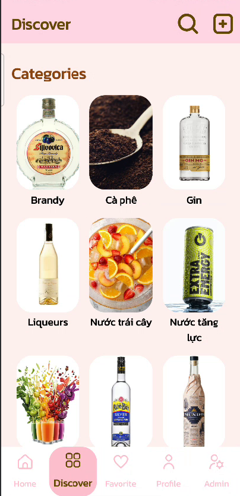
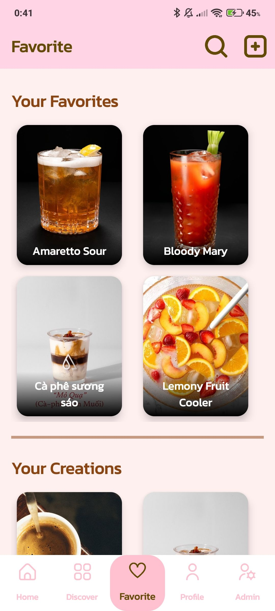
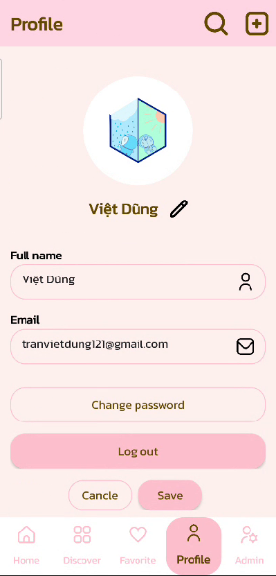
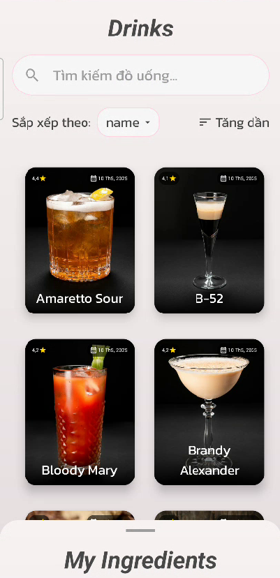
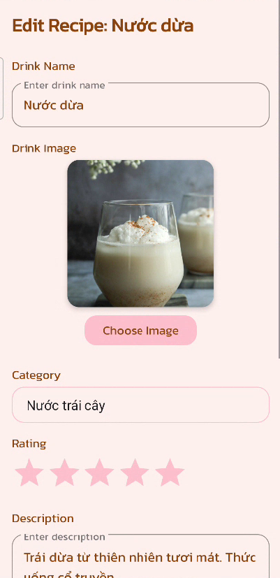
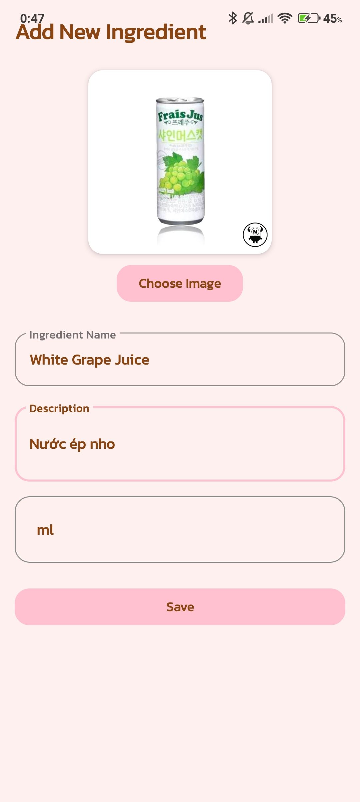
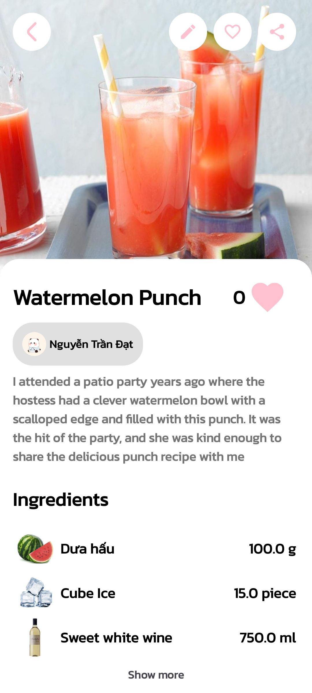
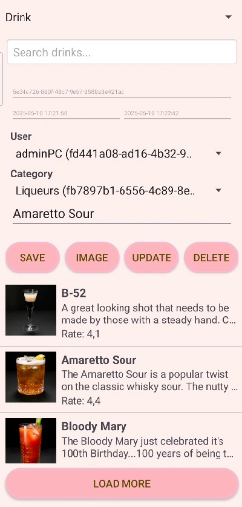

# Bài tập lớn Android - Nhóm 04 - Lớp CNPM 06

Lượt thuyết trình 7 buổi 15/05
<!-- 3 14 15 7 5 9 4 (15/05) | 2 6 8 10 11 12 13 16 (23/05) -->

## Chủ đề

Mạng xã hội về tạo và chia sẻ công thức pha chế các loại đồ uống hấp dẫn. Có lưu trữ dữ liệu lên cloud, nên có thể truy cập từ mọi nơi, mọi thiết bị Android. Có xác thực tài khoản, hỗ trợ đăng kí, đăng nhập.

## Thành viên

| Họ và tên          | Mã sinh viên | Phân công                                                                                                                                                   |
| :----------------- | :----------: | :---------------------------------------------------------------------------------------------------------------------------------------------------------- |
| Trần Việt Dũng     |  B21DCCN036  | Nghiên cứu kết nối dữ liệu Firebase Cloud Store và Cloudinary (Imgur đã loại bỏ) để lưu trữ ảnh (Dao + Model), 7 trang quản lý bên admin, Thiết kế cấu trúc dữ liệu, Logic tìm kiếm |
| Trần Đức Lộc       |  B21DCCN492  | Trang chi tiết đồ uống, bình luận và đánh giá, trang tìm kiếm có filter theo chuỗi nhập, category, ingredient kết hợp sắp xếp theo tên, ngày tạo, rate      |
| Nguyễn Trần Đạt    |  B21DCCN216  | Home, Profile, Navigation, Welcoming, Login, Signup, Xây dựng cấu trúc MVP                                                                                  |
| Đặng Thị Hồng Ngát |  B21DCCN564  | Trang discover hiển thị danh sách Category và danh sách Ingredient, trang favorite hiển thị các đồ uống yêu thích và các công thức cá nhân.                                                                                                                              |
| Nguyễn Quang Hà    |  B21DCCN312  | Chức năng tạo, copy, sửa công thức mới, tạo nguyên liệu mới (Logic + giao diện)                                                                             |

## Các công nghệ áp dụng

- Công cụ: Android studio
- Ngôn ngữ: Java
- UI framework: 
  - XML: xây dựng giao diện
  - View Binding
- Architecture: MVP (Model - View - Presenter)
- Database: 
  - Firebase Authentication: Đăng nhập và xác thực người dùng.
  - Firebase FireStore Database + Imgur
  - SharedPreferences (lưu cài đặt người dùng cục bộ)
- Các thư viện hỗ trợ:
  - com.squareup.okhttp3:okhttp:4.12.0: xử lý API với Imgur để down/up ảnh (không còn sử dụng do Imgur đã ban ip Việt Name)
  - com.cloudinary:cloudinary-android:2.3.1: xử lý API với Cloudinary để down/up ảnh
  - com.google.firebase:firebase-firestore, com.google.firebase:firebase-bom:33.13.0: kết nối và xử lý truy vấn đến cơ sở dữ liệu
  - Glide: Thư viện load và caching ảnh từ link
  - androidx.swiperefreshlayout:swiperefreshlayout:1.2.0-alpha01: Kéo để load lại trang
  - com.google.android.material:material:1.2.0: Thư viện giao diện của Google
  - com.ogaclejapan.arclayout:library:1.1.0@aar: Áp dụng hỗ trợ giao diện chào mừng.

## Các chức năng chính

- Đăng nhập, Đăng ký bằng Firebase Authentication
- Trang chủ có các danh mục: 
  - Đồ uống gợi ý ngẫu nhiên
  - Category gợi ý ngẫu nhiên
  - Nút tìm kiếm
  - Nút thêm mới
  - Các danh sách đồ uống theo phân loại cụ thể (Trending, Recommend, Latest, Highest Rate,...)
- Trang discover
  - Danh sách Category, Ingredients
  - Ấn vô 1 category/Ingredients -> Danh sách gồm tất cả các loại đồ uống tương ứng (  - Thanh tìm kiếm, filter.)
- Trang Favorite: Danh sách các đồ uống được người dùng tạo, yêu thích.
- Trang cài đặt tài khoản
  - Thay đổi thông tin cá nhân
  - Đổi mật 
  - Đăng xuất
- Trang admin (chỉ có tài khoản role admin mới xuất hiện):
  - Quản lý (Thêm, Sửa, Xóa) Category, Drink, Ingredient, Recipe, Review, Favorite, User.
  - Tìm kiếm Drink, Ingredient.

## Thiết kế model

- Model Drink đồ uống:
  - uuid
  - Tên đồ uống
  - id user
  - Image
  - id Category
  - Instruction
  - Description
  - Rate (mặc định)
  - createdAt
  - updatedAt
- Model Recipe
  - uuid
  - id đồ uống
  - id Nguyên liệu
  - Liều lượng/số lượng
  - createdAt
  - updatedAt
- Model Nguyên liệu (Ingredients) - Mặc định
  - uuid
  - Tên nguyên liệu
  - Description
  - Image
  - Đơn vị
  - createdAt
  - updatedAt
- Model user
  - uuid
  - saveUuidFromAuthen
  - name
  - email
  - password
  - Image
  - createdAt
  - updatedAt
- Model Category - Mặc định
  - uuid
  - name
  - description
  - image
  - createdAt
  - updatedAt
- Model Review
  - uuid
  - id user
  - id đồ uống
  - comment
  - rate
  - createdAt
  - updatedAt
- Model Favorite
  - uuid
  - id user
  - id đồ uống
  - createdAt
  - updatedAt
- Model DrinkCntFav
  - uuid
  - drinkId
  - count
  - createdAt
  - updatedAt

## Các đầu mục công việc
- Nghiên cứu kết nối dữ liệu FireStore và Cloudinary (Imgur đã loại bỏ do ban ip upload từ Việt Nam), Dao + Model, các trang quản lý db (admin) (Dũng) (Package data)
- Chức năng đăng kí, đăng nhập bằng Email, password với Firebase Authentication (Package Login) (Đạt)
- Chức năng tạo công thức mới (Logic + giao diện) (Hà) (Activity) (Package CreateDrink)
  - Ô nhập tên đồ uống
  - Thêm ảnh đồ uống
  - Ô nhập String hướng dẫn các bước pha chế
  - Rate (0 - 5 star) giống cô hướng dẫn
  - Ô nhập Description
  - Dropdown chọn Category
  - Recycle view hiển thị danh sách nguyên liệu
    - Nút thêm nguyên liệu
    - Dropdown chọn nguyên liệu (có ảnh nguyên liệu sẵn và tên)
    - Số lượng, liều lượng (có đơn vị ở cạnh)

- Trang chủ, trang profile, Navigation (Đạt) (Package Main)

- Trang chi tiết đồ uống, trang tìm kiếm có filter (Lộc) 
  - Trang chi tiết đồ uống (Activity) (Package DetailDrink)
    - Nút favorite
    - Nút Chia sẻ (Optional)
    - Tên
    - name Tác giả
    - Category
    - Instruction
    - Description
    - Rate (mặc định)
    - Review list
    - Ô review + Rate (0 - 5 star) giống cô hướng dẫn (Option)
  - Trang tìm kiếm (Activity) (Package Search)
    - Thanh tìm kiếm tìm tực thì khi gõ.
    - filter
      - category : checkbox + recycle view
      - ingredients: dropdown
- Trang discover, trang favorite, (Ngát) (Fragment) (Package Discover)
  - Discover:
    - Category: Recycle view
    - Ingredient: Recycle view
    - Khi ấn gửi Intent chứa nội dung 
          "idCategory = xyz, idIngredient = null" đi đén Trang tìm kiếm.
  - Favourite:
    - Danh sách favourite
      - RecyclerView, Vertical + GridLayoutManager
      - Item: Tên, ảnh, nút trái tim (click -> thêm/xóa favourite)
    - Danh sách công thức do bản thân tạo

Logic tìm kiếm và sắp xếp (Xử lý khi query và 1 phần ở DAO) (Dũng)

Có 4 trường hợp chính:

1. Nếu có Category / Name và có list IngredientID
   - Bước 1 Đầu tiên gọi tới hàm public void searchDrinksByCategory(String query, @Nullable String categoryId, DrinkListCallback callback) nhận về được list<Drink>  thỏa mãn 2 điều kiện SearchString và CategoryID
   - Bước 2 Lấy list<String> DrinkID từ list<Drink> dùng hàm của RecipeDAO: public void searchDrinkIDByIngredient(list<String> DrinkID, list<String> IngredientID, DrinkIDListCallback callback)
   - Bước 3 Nhận về list<String> DrinkID mới thì lọc lại list<Drink> ban đầu, lấy ra các Drink thỏa mã cả 3 điều kiện lọc
   - Bước 4 Sort lại theo name Drink
2. Nếu có Category / Name và không có list IngredientID
   - Bước 1 Đầu tiên gọi tới hàm public void searchDrinksByCategory(String query, @Nullable String categoryId, DrinkListCallback callback) nhận về được list<Drink>  thỏa mãn 2 điều kiện SearchString và CategoryID
   - Bước 2 Sort lại theo name Drink
3. Nếu không có Category / Name và có list IngredientID
   - Bước 1 Gọi tới RecipeDAO trước public void searchDrinkIDByIngredientNoListDrinkID(list<String> IngredientID, DrinkIDListCallback callback)
   - Bước 2 Trả về 1 list<String> DrinkID 
   - Bước 3 Bên DrinkDAO gọi hàm getAllDrinkWithListDrinkID (list<String> DrinkID, DrinkListCallback callback)
   - Bước 4 Sort lại theo name Drink
4. Nếu không có Category / Name và không có list IngredientID
   - Bước 1 Gọi getAllDrinkWithLimit(int limit, DrinkListCallback callback) trong DrinkDAO

## Giao diện

### Homepage

  

### Discover

  

### Favorite

  

### Profile

  

### Tìm kiếm

  

### Trang tạo, sửa, copy đồ uống

  

### Trang tạo nguyên liệu

  

### Trang chi tiết đồ uống

  

### Trang quản lý admin

  

## Nguồn tham khảo giao diện

- https://play.google.com/store/apps/details?id=com.cocktailarium.mobile
- https://play.google.com/store/apps/details?id=com.gelostech.pocketbartender
- https://play.google.com/store/apps/details?id=com.shaker.app

## Hướng dẫn cài đặt

- Có thể tự đăng kí tài khoản và test. (Với role User)
- Tài khoản admin: liên hệ tranvietdung121@gmail.com
